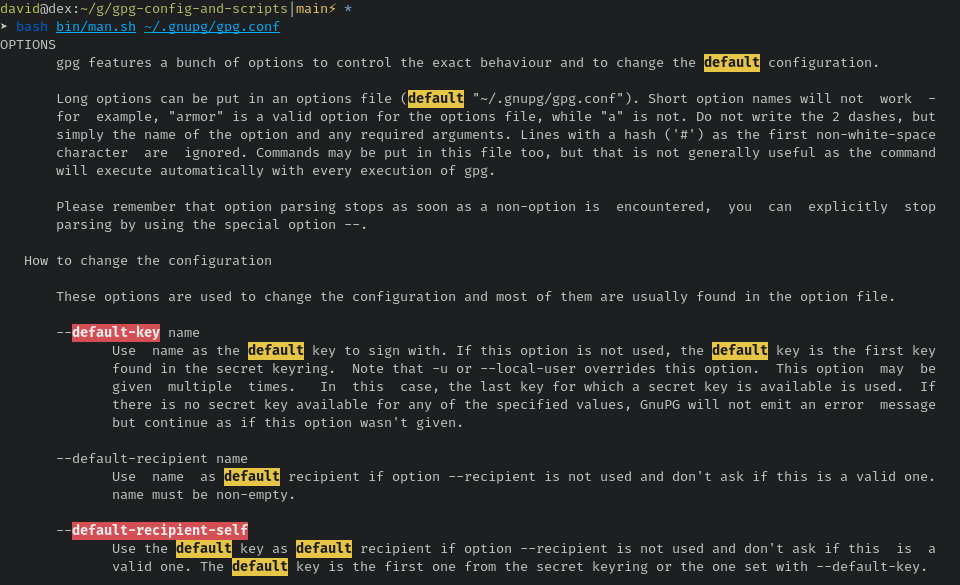
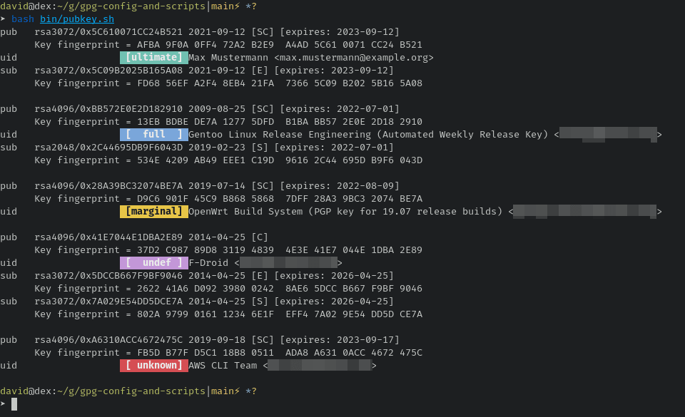
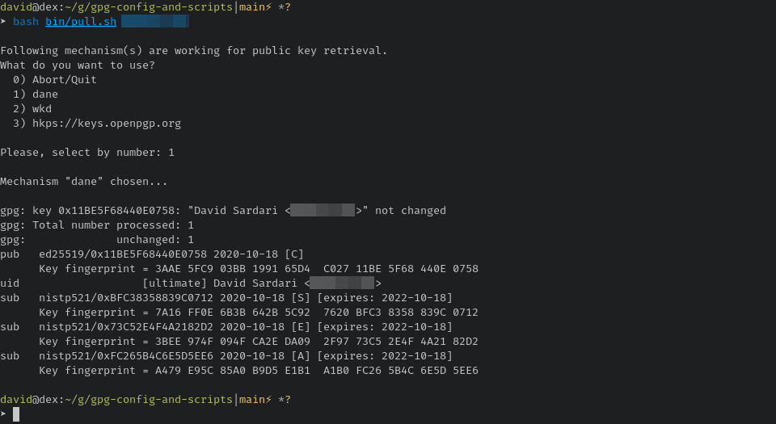

# My GnuPG configuration and some helper scripts

> ️⚠️ You can find information on my GnuPG public key in my [GitHub profile README](https://github.com/duxsco/)! ⚠️

> ⚠️ If you want to create a new keypair, you cann follow the section [Create a GnuPG keypair](https://github.com/duxsco/gpg-smartcard#create-a-gnupg-keypair). ⚠️

## System requirements

This repo assumes you using GnuPG 2.3.x (stable).

macOS needs these [HomeBrew](https://brew.sh) packages to be installed:

- `bash`
- `findutils`
- `gnupg`
- `gnu-sed`

You need to comment out `default-key` as well as `encrypt-to` in `gpg.conf` OR set the ID of one of your secret keys. The same applies to `sender` where you have to provide your UID's e-mail address or comment the option out altogether. To print full-length personal key IDs and e-mail addresses:

```bash
gpg --list-options show-only-fpr-mbox --list-secret-keys
```

## Understand the GnuPG configuration

To better understand GnuPG config options you can use [man.sh](bin/man.sh) to display man pages while highlighting defaults (in yellow) and options that have been set in the configuration file (in red).



```bash
# print man.sh help
bash bin/man.sh

# print "OPTIONS" section of the manpage while
# highlighting options set in the .conf red and "default" in yellow
bash bin/man.sh gpg.conf

# If "less" doesn't show any colors, use the "-R" (--RAW-CONTROL-CHARS) flag
bash bin/man.sh ~/.gnupg/gpg.conf | less -R
```

## List public keys and delete untrusted ones

With [pubkey.sh](bin/pubkey.sh), public keys are listed from top to bottom, colored and grouped by following trust levels:

1. `ultimate`
2. `full`
3. `marginal`
4. `undefined`
5. The rest: `unknown`, `expired`, `never trust`, `revoked` and `error`

- To print the list:



```bash
bash bin/pubkey.sh
```

- To delete any public key without trust level `ultimate`, `full`, `marginal` and `undefined` you have to pass the `-d` flag. You will be prompted and must confirm the deletion of each public key.


```bash
bash bin/pubkey.sh -d
```

## Pull public keys

GnuPG offers multiple mechanism to pull a public key. [pull.sh](bin/pull.sh) tries out a predefined list of mechanism and lets you choose one of them for pulling the public key:



```bash
# print pull.sh help
bash bin/pull.sh

# pull a certain key
bash bin/pull.sh <KEY ID>
```

## SSH support

Launch `gpg-agent` with `ssh` support:

```bash
echo enable-ssh-support >> ~/.gnupg/gpg-agent.conf
```

Copy the keygrip from your authentication subkey and add to `~/.gnupg/sshcontrol`:

```bash
gpg --list-secret-keys --with-keygrip
```

Add to your `~/.bashrc`:

```bash
unset SSH_AGENT_PID
SSH_AUTH_SOCK="$(gpgconf --list-dirs agent-ssh-socket)"
export SSH_AUTH_SOCK
```

Export your `ssh` public key and add to your server's `~/.ssh/authorized_keys`:

```bash
gpg --export-ssh-key <KEY ID>
```

I prefer typing in my pin for my [GnuPG smartcard](https://github.com/duxsco/gpg-smartcard) every time:

```bash
echo "LocalCommand gpgconf --reload scdaemon" >> ~/.ssh/config
sudo -i bash -c "echo 'PermitLocalCommand yes' >> /etc/ssh/ssh_config"
```

## Other GnuPG repos

https://github.com/duxsco?tab=repositories&q=gpg-
